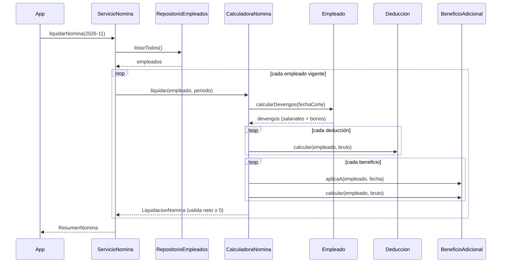

# Diagramas

## Diagrama de clases

```mermaid
classDiagram
    direction TB

    class Empleado {
        <<abstract>>
        -DatosEmpleado datos
        +calcularDevengos(LocalDate) List~ConceptoNomina~
        +calcularSalarioBruto(LocalDate) BigDecimal
        #conceptosSalariales()* List~ConceptoNomina~
        #conceptosDeBonificacion(LocalDate) List~ConceptoNomina~
        +tieneAntiguedadMayorA(int, LocalDate) boolean
        +estaVigenteEn(LocalDate) boolean
        +getTipo()* TipoEmpleado
    }
    class EmpleadoPermanente {
        <<interface>>
    }
    class ElegibleFondoAhorro {
        <<interface>>
        +aceptaFondoAhorro() boolean
        +tieneAntiguedadMayorA(int, LocalDate) boolean
    }
    class EmpleadoAsalariado {
        -BigDecimal salarioMensual
    }
    class EmpleadoPorHoras {
        -BigDecimal tarifaPorHora
        -BigDecimal horasTrabajadas
        -boolean aceptaFondoAhorro
        +registrarHorasTrabajadas(BigDecimal)
    }
    class EmpleadoPorComision {
        -BigDecimal salarioBase
        -BigDecimal tasaComision
        -BigDecimal ventas
        +registrarVentas(BigDecimal)
    }
    class EmpleadoTemporal {
        -BigDecimal salarioMensual
        -LocalDate fechaFinContrato
    }
    class DatosEmpleado {
        <<record>>
        documento
        nombre
        fechaIngreso
        nivelRiesgoArl
    }

    Empleado <|-- EmpleadoAsalariado
    Empleado <|-- EmpleadoPorHoras
    Empleado <|-- EmpleadoPorComision
    Empleado <|-- EmpleadoTemporal
    EmpleadoPermanente <|.. EmpleadoAsalariado
    EmpleadoPermanente <|.. EmpleadoPorComision
    ElegibleFondoAhorro <|.. EmpleadoPorHoras
    Empleado *-- DatosEmpleado

    class Deduccion {
        <<interface>>
        +calcular(Empleado, BigDecimal) ConceptoNomina
    }
    class SeguridadSocialPension
    class Arl
    Deduccion <|.. SeguridadSocialPension
    Deduccion <|.. Arl

    class BeneficioAdicional {
        <<interface>>
        +aplicaA(Empleado, LocalDate) boolean
        +calcular(Empleado, BigDecimal) BeneficioLiquidado
    }
    class BonoAlimentacion
    class FondoAhorro
    BeneficioAdicional <|.. BonoAlimentacion
    BeneficioAdicional <|.. FondoAhorro

    class CalculadoraNomina {
        -List~Deduccion~ deducciones
        -List~BeneficioAdicional~ beneficios
        +liquidar(Empleado, YearMonth) LiquidacionNomina
    }
    CalculadoraNomina o-- Deduccion
    CalculadoraNomina o-- BeneficioAdicional
    CalculadoraNomina ..> LiquidacionNomina : crea

    class LiquidacionNomina {
        +getSalarioBruto() BigDecimal
        +getTotalDeducciones() BigDecimal
        +getSalarioNeto() BigDecimal
    }

    class RepositorioEmpleados {
        <<interface>>
        +guardar(Empleado)
        +buscarPorDocumento(String) Optional~Empleado~
        +listarTodos() List~Empleado~
    }
    class RepositorioEmpleadosEnMemoria
    RepositorioEmpleados <|.. RepositorioEmpleadosEnMemoria

    class ServicioNomina {
        +registrarEmpleado(Empleado)
        +liquidarEmpleado(String, YearMonth) LiquidacionNomina
        +liquidarNomina(YearMonth) ResumenNomina
    }
    ServicioNomina --> RepositorioEmpleados
    ServicioNomina --> CalculadoraNomina
```

## Diagrama de secuencia: liquidar la nómina del mes

```mermaid
sequenceDiagram
    participant App
    participant S as ServicioNomina
    participant R as RepositorioEmpleados
    participant C as CalculadoraNomina
    participant E as Empleado
    participant D as Deduccion
    participant B as BeneficioAdicional

    App->>S: liquidarNomina(2026-11)
    S->>R: listarTodos()
    R-->>S: empleados
    loop cada empleado vigente
        S->>C: liquidar(empleado, periodo)
        C->>E: calcularDevengos(fechaCorte)
        E-->>C: devengos (salariales + bonos)
        loop cada deducción
            C->>D: calcular(empleado, bruto)
        end
        loop cada beneficio
            C->>B: aplicaA(empleado, fecha)
            C->>B: calcular(empleado, bruto)
        end
        C-->>S: LiquidacionNomina (valida neto ≥ 0)
    end
    S-->>App: ResumenNomina
```
